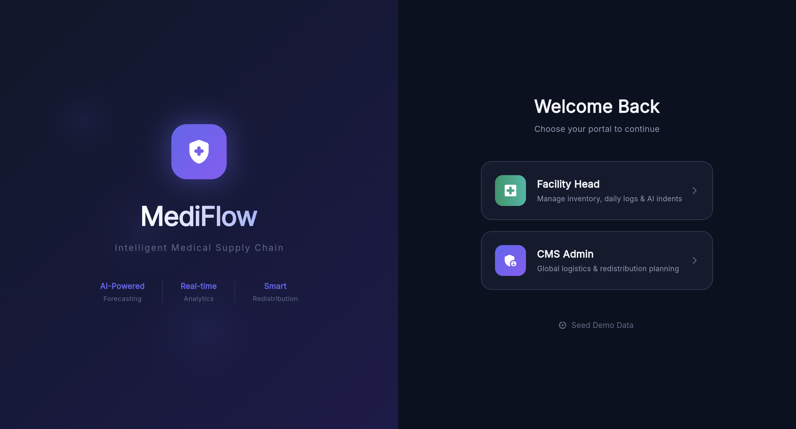

```markdown name=README.md url=https://github.com/Nebulyn-Labs/MediFlow/blob/352cc759e8536303b57957c240e76e37ea5ffbd0/README.md
# MediFlow

AI-powered medical logistics platform focused on smart resource allocation

**[Explore the docs »](#project-overview)** ·  
**[Report a Bug](https://github.com/Nebulyn-Labs/MediFlow/issues)** · **[Request a Feature](https://github.com/Nebulyn-Labs/MediFlow/issues)**


[](LICENSE)
[](https://github.com/Nebulyn-Labs/MediFlow/stargazers)
[](https://github.com/Nebulyn-Labs/MediFlow/network/members)
[](https://github.com/Nebulyn-Labs/MediFlow/issues)
[](https://github.com/Nebulyn-Labs/MediFlow/graphs/contributors)
[](CONTRIBUTING.md)

[](https://discord.gg/B4Z8MKmzcz)

---

## Table of Contents

- [Project Overview](#project-overview)
- [The Problem & The Solution](#the-problem--the-solution)
- [Screenshots & UI Preview](#screenshots--ui-preview)
- [Core Feature Set](#core-feature-set)
- [Technical Architecture](#technical-architecture)
- [Tech Stack](#tech-stack)
- [Project Structure](#project-structure)
- [Data & Schema](#data--schema)
- [Development & Setup Guide](#development--setup-guide)
- [Troubleshooting](#troubleshooting)
- [Future Developments](#future-developments)
- [Contributing](#contributing)
- [License](#license)
- [The Team](#the-team)

---

## Project Overview

**MediFlow** is an enterprise-grade medical logistics platform engineered to
solve the "Last Mile" medical supply crisis. By combining **Generative AI** for
demand forecasting with **Custom Optimization Heuristics**, we optimize
redistribution of medical supplies across a network of urban and rural
healthcare facilities.

---

## The Problem & The Solution

**The Crisis:** Rural clinics often face 30% higher stockout rates for essential
antibiotics, while urban hospitals simultaneously dispose of expired stock due
to over-purchasing. This inequality claims lives.

**The MediFlow Solution:** We don't just track inventory; we **predict**
shortages before they happen and **automate** the movement of medicine from
surplus hospitals to deficit clinics using road-optimized routing.

---

## Screenshots & UI Preview

Here is a preview of the MediFlow home page:



MediFlow provides two types of roles:

- Role -> Admin

Here is a preview of Admin Dashboard


- Role -> Facility

Here is a preview of Facility manager Dashboard


It also provides following features:

- AI analysis of supply


- Route optimization for delivery via AI (Admin only)


- Demand forecast


---

## Core Feature Set

### Hospital / Facility Module

| Feature | Detailed Description |
| :--- | :--- |
| **Smart Logging Engine** | Atomically track daily usage while the system computes burn rates in real-time, ensuring zero data loss even in low-connectivity areas. |
| **AI Forecasting (30-Day)** | Powered by **Gemini-1.5-Flash**, predicting seasonal spikes based on historical usage trends (e.g., ORS demand for summer) with a transparency-first "AI Reasoning"[...] |
| **Automated Request Drafting** | Intelligent auto-population of restock indents and redistribution offers based on AI predictions, reducing administrative overhead for clinic managers. |
| **AI Chat Assistant** | A 24/7 logistics expert that facility managers can query for stock status, expiry alerts, or burn-rate insights using natural language. |

### Central Administration Module

| Feature | Detailed Description |
| :--- | :--- |
| **Global Command Center** | Real-time regional oversight with deep-dive analytics into every facility's stock health, parity, and regional logistics KPIs. |
| **Approval Pipeline** | A secure hub for regional admins to review, edit, and prioritize redistribution plans proposed by the optimization engine. |
| **Interactive Logistics Map** | High-visibility markers distinguishing surplus sites from deficit clinics with integrated OSRM/ORS paths that calculate real-world travel time and distance. |
| **Global Optimization** | A "Global Redistribution Plan" that matches thousands of shortage items to local surpluses in seconds using our proprietary matching logic. |

---

## Technical Architecture

MediFlow utilizes a decoupled, serverless architecture that bridges a
responsive frontend client with intelligent background processing.

### Architecture Overview

```mermaid
graph TD
    A[Flutter Web / Mobile Client] -->|Auth & Live Sync| B[Firebase Auth & Firestore]
    A -->|Direct Call| C[Cloud Functions Node.js]
    C -->|Secret Key| D[Gemini 1.5 Flash API]
    C -->|Data Archiving| E[Google Cloud BigQuery]
    A -->|Geospatial Queries| F[OpenRouteService / OSRM API]
    B -->|Trigger Functions| C
